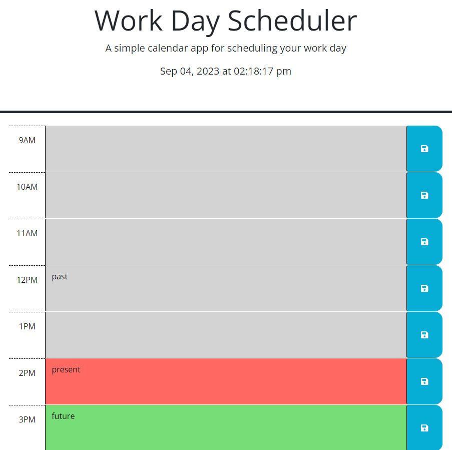

# Work Day Scheduler

# Sumamry

This is a helpful tool for scheduling your work day. It was created using starter code for HTML, CSS and Javascript. When you open the scheduler you will notice a few things. At the top of the schduleer is the header which includes a title, a brief description and the current date and time. In the body of the scheduler you will see time blocks for 9 a.m. through 5 p.m. Based on the current time of day these will either be gray (past), red (present), or green (future). When you click on a time block you are able to type into it an event that you must do. Once you have entered the event, you can hit the save button off to the right of it. Once you have saved you can refresh your page and see that the text you typed is still showing.

# Example Picture

# Author
Michael Engstrand

* Repo Link:
https://github.com/mikeengstrand/work-day-scheduler

* Live Link:
https://mikeengstrand.github.io/work-day-scheduler/
